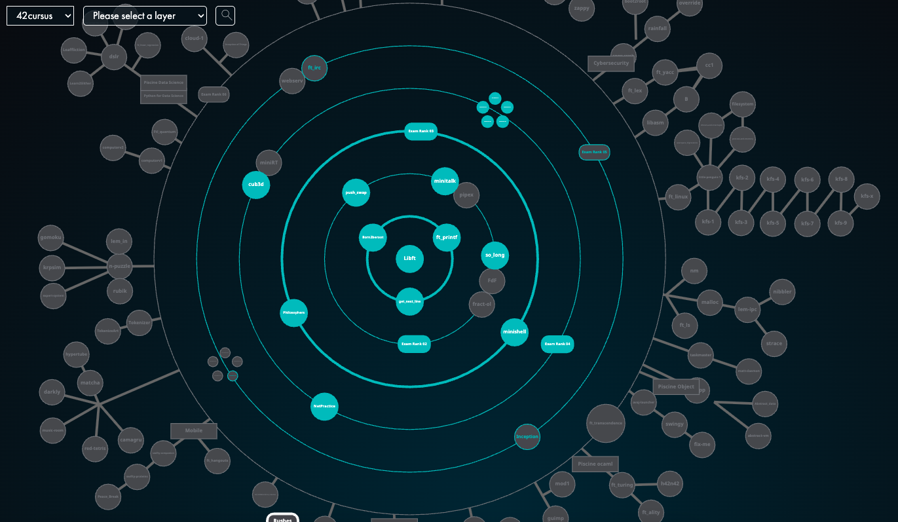

###

<h1 align="left">Tech Stack</h1>

###

  
  
  
  
  
  
  
  
  
  
  
  
  
  
  
  
  
  
  
  
  
  
  
  
  
  
  
  
  
  
  
  
  
  
  
  
  

###

###

<h1 align="left">About me</h1>

###

  
  

###

<h1 align="left">My 42tokyo Projects</h1>

###

  

| lank | project name | description | repo link |
| ---- | ------------ | ----------- | --------- |
| 1 | Libft | The C standard library, implemented from scratch. | https://github.com/jaytakahashii/42_libft |
| 2 | ft_printf | Reimplementation of printf function. | https:://github.com/jaytakahashii/42_ftPrintf |
| 2 | get_next_line | Implementing a function to read the next line. | https:://github.com/jaytakahashii/42_GetNextLine |
| 2 | Born2beroot | Build Linux in a virtual environment. | https:://github.com/jaytakahashii/42_Born2beRoot |
| 3 | push_swap | Sort a stack of integers with the fewest moves. | https:://github.com/jaytakahashii/42_PushSwap |
| 3 | so_long | A simple game using the MLX library. | https:://github.com/jaytakahashii/42_soLong |
| 3 | minitalk | A simple shell implementation. | https:://github.com/jaytakahashii/42_minitalk |
| 4 | minishell | A simple shell implementation. | https:://github.com/jaytakahashii/42_minishell |
| 4 | Philosophers | A simulation of the dining philosophers problem. | https:://github.com/jaytakahashii/42_Philosophers |
| 5 | NetPractice | A project to learn about network programming. | https:://github.com/jaytakahashii/42_NetPractice |
| 5 | cub3D | A 3D game engine. | https:://github.com/jaytakahashii/42_cub3D |
| 5 | cpp_module | A C++ module. | https:://github.com/jaytakahashii/42_cpp_module |
| 6 | cpp_module_2 | A C++ module. | https:://github.com/jaytakahashii/42_cpp_module_2 |
| 6 | ft_irc | A simple IRC server. | https:://github.com/jaytakahashii/42_ft_irc |
| 6 | inception | A project to learn about network programming. | coming soon... |
| 7, 8 | ft_transcendence | A project to learn about network programming. | coming soon... |

###

<h1 align="left">Social Media</h1>

###

  
  
  
  
  

